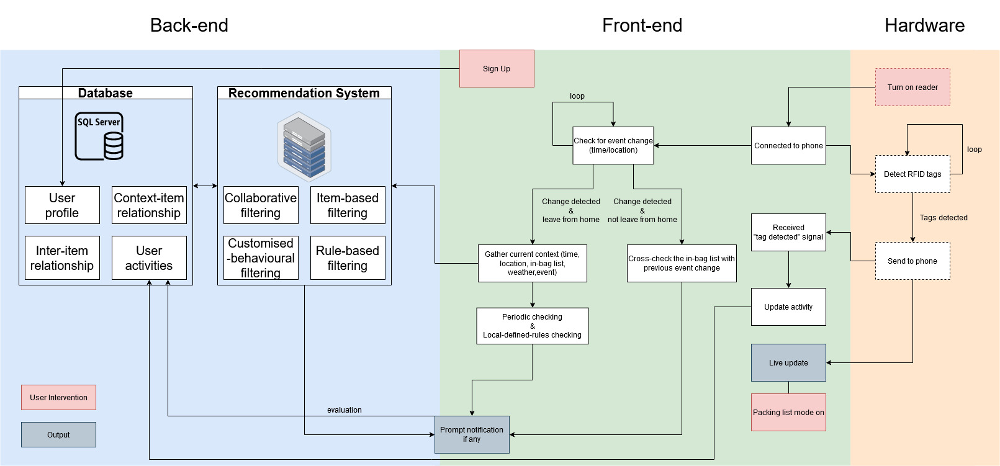

# vb_v0
This project is for internal use only. Any form of use without prior consent infridges the ownership and copyright of the creator of this repository.

Abstract\n
With ultra-high frequency (UHF) radio-frequency identification (RFID) technology, RFID tags can be scanned in a longer range and has a better anti-collision feature. This project applies the identification technology into a personal and portable item-level tracking system, Virtual Butler. It acts as an automated personal assistance by tracing tagged items’ in-n-out activities from a confined area. The system analyses users’ item usage and helps solving their day-to-day problems they faced when organising their belongings.

